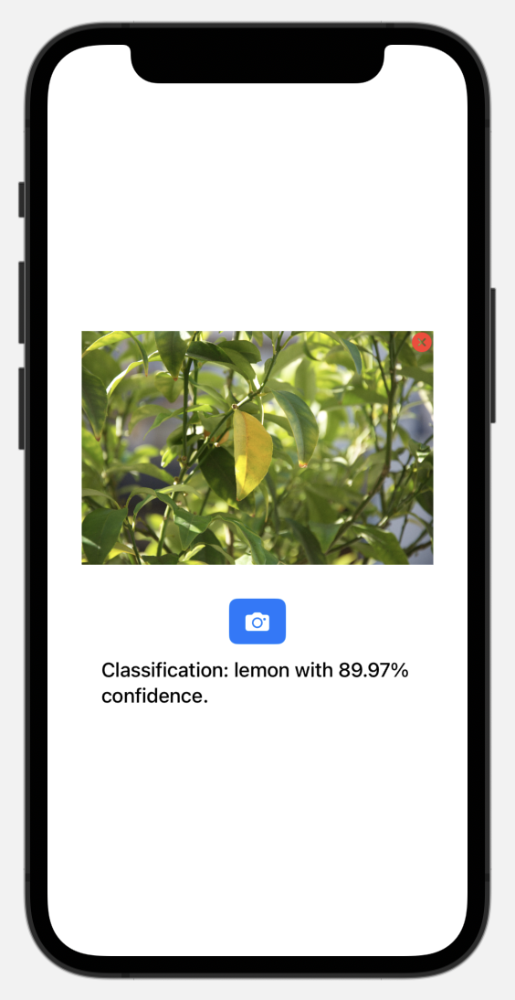

# Swift iOS Image Classifier

This is an iOS application that uses a pre-trained Core ML model (SqueezeNet) to classify images selected from the photo library. Upon selecting an image, the model performs an image classification and displays the predicted label with its confidence score. The project uses SwiftUI for the UI and Vision framework for running Core ML requests.

## Features

- Select an image from the device's photo library using the PHPicker.
- Display the selected image in the app's main view.
- Classify the image using the SqueezeNet model.
- Display the classification result, including the label and confidence score.
- Clear the selected image with an "X" button, returning the app to the initial "No image selected" state.

## Preview



:sweat_smile: Yeah...

## Code Structure

### `ContentView.swift`

The main SwiftUI view containing:
- A photo selection button to open the photo library.
- An image display area.
- A classification label that displays the prediction result.
- A button to clear the selected image.

The `classifyImage(_:)` function loads the Core ML model and uses Vision to perform the classification.

### `PhotoPicker.swift`

A `UIViewControllerRepresentable` wrapper for the `PHPickerViewController`, allowing integration with SwiftUI to select images from the photo library.

## Requirements

- iOS 15.6+
- Xcode 16.1+
- Swift 6.0.2+
- Core ML and Vision frameworks

## Usage

1. **Clone the Repository**: Clone this repository to your local machine.
    ```bash
    git clone https://github.com/your-username/swift-ios-classify-image.git
    cd swift-ios-classify-image
    ```

2. **Install Core ML Model**: Download the SqueezeNet Core ML model and add it to your Xcode project (use `SqueezeNet.mlmodel` in the project navigator).

3. **Run the App**: Open the project in Xcode, select your device or simulator, and click "Run" to build and launch the app.

4. **Select and Classify an Image**:
   - Tap the camera button to open the photo picker.
   - Select an image to classify.
   - View the classification result displayed beneath the image.
